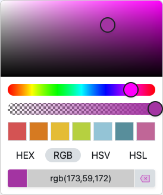
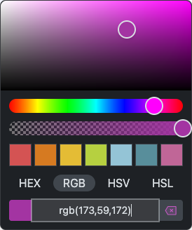

# Javascript Color Picker

An open source, free (as in beer), versatile, flexible and lightweight Javascript Color Picker Component supporting light and dark skins, swatches, multiple color formats, CSS color parsing, instant and confirm modes and much more.

## Please visit [jscolorpicker.com](https://www.jscolorpicker.com/) for more detailed documentation and extensive demo's.<br><br>
## This is a fork created to try to add gradient support

## Table of Contents

- [Features](#features)
- [Live Demo](#live-demo)
- [Screenshots](#screenshots)
- [Installation](#installation)
  - [IIFE Bundle](#iife-bundle)
  - [ESM Bundle](#esm-bundle)
- [Getting Started](#getting-started)
  - [Creation](#creation)
  - [Opening](#opening)
  - [Setting Color](#setting-color)
  - [Binding Events](#binding-events)
  - [Dialog Only](#dialog-only)
  - [Gradient Support](#gradient-support)
- [Documentation](#documentation)
- [Customization](#customization)
  - [Color Scheme](#color-scheme)
  - [CSS Variables](#css-variables)
- [Developing](#developing)
- [License](#license)

## Features

- 🏋️ Light weight (42kB minified, 14.5kB minified and gzipped)
- 0️⃣ Zero dependencies
- 😎 Easy to use and customize
- 🔼 Button, input and hidden styles
- 👆🏻 Touch friendly
- 🌙 Dark and light theme
- 🫥 Alpha slider (can be disabled)
- 🌈 Color Swatches
- 🔢 Multiple color formats
- ✢ Uses popper.js for positioning
- 🪞 Preview
- ✅ Apply color immediately, or on submit
- 📜 CSS color parsing (including named colors)
- 💧 EyeDropper on Chrome and Edge
- ⌨️ Keyboard support
- 🚫 Clearable
- 🎨 **Gradient Support** - Create linear gradients with angle control

## Live Demo

See the [demo page](https://www.jscolorpicker.com/#demo)

## Screenshots

|            |                         Light                          |                         Dark                          |
| :--------- | :----------------------------------------------------: | :---------------------------------------------------: |
| **Button** |   |   |
| **Input**  |   |   |
| **Dialog** |  |  |

## Installation

The color picker requires a tiny stylesheet. Please include it like this:

```html
<link rel="stylesheet" href="colorpicker.css" />
```

Now, depending on your environment, choose one of the following:

- IIFE Bundle → When using vanilla JavaScript, without ES modules
- ESM Bundle → When using ES modules or a bundler

### IIFE Bundle

Please import the IIFE script using a `script` tag in your HTML:

```html
<script src="colorpicker.iife.js"></script>
```

This exposes the `ColorPicker` class (on window).

### ESM Bundle

Please import the ESM bundle using the `import` directive in your script:

```js
import ColorPicker from 'colorpicker.js'
```

This allows you to use `ColorPicker` directly.

## Getting Started

### Creation

To create a color picker, first create a button or input:

```html
<button id="picker"></button>
<!-- or -->
<input id="picker" />
```

Next instantiate the ColorPicker, passing an element to bind to and an (optional) configuration:

```js
const picker = new ColorPicker('#picker', {
  submitMode: 'instant'
})
```

### Opening

If you want to open or close the dialog, use their respective methods:

```js
picker.open()
picker.close()
picker.toggle()
picker.destroy()
```

You can also open it as a prompt, returning a promise once the picker is closed:

```js
const color = await picker.prompt()
```

### Setting Color

If you want to set or clear the color, you can use the `.setColor()` and `.clear()` methods:

```js
picker.setColor('#ff00ff')
picker.clear()
```

### Binding Events

If you want to listen to certain events, like opening or picking, use the `.on()` method:

```js
picker.on('pick', (color) => console.log('pick', color))
picker.on('open', () => console.log('open'))
picker.on('opened', () => console.log('opened'))
picker.on('close', () => console.log('close'))
picker.on('closed', () => console.log('closed'))
```

### Dialog Only

If you want to open a picker dialog without a toggle, (optionally) destroying it after, you can use the `headless` option with the `prompt()` method:

```js
const picker = new ColorPicker(target, {
  headless: true,
})

const color = await picker.prompt(true)
```

## Gradient Support

The color picker now supports linear gradients with customizable angles. To enable gradient functionality, set the `allowGradientSelection` configuration option to `true`:

```js
const picker = new ColorPicker('#picker', {
  allowGradientSelection: true
})
```

### Gradient Configuration

When gradient support is enabled, users can switch between "Solid Color" and "Gradient" modes in the picker interface. The gradient mode allows:

- Start and end color selection
- Angle control (0-360 degrees) with both slider and numeric input
- Real-time preview of the gradient

### Gradient Events

The picker emits the same events for both solid colors and gradients. When a gradient is selected, the `pick` event receives a gradient data object:

```js
picker.on('pick', (data) => {
  if (data && typeof data === 'object' && data.type === 'gradient') {
    // Handle gradient data
    console.log(`Gradient: ${data.angle}° from ${data.startColor.string('hex')} to ${data.endColor.string('hex')}`)
    
    // Access gradient properties
    const startColor = data.startColor  // Color object
    const endColor = data.endColor      // Color object  
    const angle = data.angle            // Number (0-360)
    
    // Generate CSS gradient
    const css = `linear-gradient(${angle}deg, ${startColor.string('hex')}, ${endColor.string('hex')})`
  } else {
    // Handle solid color (Color object or null)
    console.log('Solid color:', data)
  }
})
```

### Gradient Data Format

When a gradient is selected, the `pick` event receives an object with this structure:

```js
{
  type: 'gradient',
  startColor: Color,  // Color object for start color
  endColor: Color,    // Color object for end color
  angle: number       // Angle in degrees (0-360)
}
```

The `startColor` and `endColor` are full Color objects with all the same methods as regular colors (`.string()`, `.hue()`, `.saturation()`, etc.).

### Setting Gradient Programmatically

You can programmatically set gradients using the `setGradient()` method or initialize with a gradient via the configuration:

```js
// Set gradient after creation
picker.setGradient({
  type: 'gradient',
  startColor: 'red',
  endColor: 'green',
  angle: 90
})

// Or initialize with a gradient
const picker = new ColorPicker('#picker', {
  allowGradientSelection: true,
  gradient: {
    type: 'gradient',
    startColor: '#ff6b6b',
    endColor: '#4ecdc4',
    angle: 45
  }
})
```

When a gradient is set programmatically, the picker will automatically display the gradient background and remember the gradient state when reopened.

### Gradient Persistence

The picker automatically:
- Remembers gradient state when the dialog is reopened
- Persists gradient background on the picker button
- Maintains gradient settings across dialog sessions

### Example Usage

```js
const picker = new ColorPicker('#gradient-picker', {
  allowGradientSelection: true,
  submitMode: 'confirm',
  defaultFormat: 'hex'
})

picker.on('pick', (data) => {
  if (data && data.type === 'gradient') {
    // Apply gradient to element
    document.getElementById('target').style.background = 
      `linear-gradient(${data.angle}deg, ${data.startColor.string('hex')}, ${data.endColor.string('hex')})`
  } else if (data) {
    // Apply solid color
    document.getElementById('target').style.background = data.string('hex')
  } else {
    // Clear background
    document.getElementById('target').style.background = 'transparent'
  }
})

// Load saved gradient state
const savedGradient = localStorage.getItem('userGradient')
if (savedGradient) {
  const gradientData = JSON.parse(savedGradient)
  picker.setGradient({
    type: 'gradient',
    startColor: gradientData.startColor,
    endColor: gradientData.endColor,
    angle: gradientData.angle
  })
}

// Save gradient state
picker.on('pick', (data) => {
  if (data && data.type === 'gradient') {
    localStorage.setItem('userGradient', JSON.stringify({
      startColor: data.startColor.string('hex'),
      endColor: data.endColor.string('hex'),
      angle: data.angle
    }))
  }
})
```

## Documentation

For all methods and properties, please view the [documentation](DOCUMENTATION.md).

## Customization

### Color Scheme

You can change the color scheme by using one of the following dataset properties:

```html
<html data-cp-theme="dark"></html>
<html data-bs-theme="dark"></html>
<html data-cp-theme="light"></html>
<html data-bs-theme="light"></html>
```

### CSS Variables

You can alter a variety of styles using their respective CSS variables:

```css
:root {
  /* Metrics */
  --cp-size: 2.375rem; /* Size of color picker thumb */
  --cp-border-radius-sm: 0.25rem;
  --cp-border-radius-lg: 0.5rem;
  --cp-swatch-width: 2rem;

  /* Colors */
  --cp-body-bg: #fff;
  --cp-body-color: #212529;
  --cp-body-color-rgb: 33, 37, 41;
  --cp-border-color: #ccc;
  --cp-button-color: #ccc;
  --cp-border-color-translucent: rgba(0, 0, 0, 0.175);
  --cp-tertiary-color: rgba(33, 37, 41, 0.5);

  /* Shadows */
  --cp-box-shadow: 0 0.5rem 1rem rgba(0, 0, 0, 0.15);
  --cp-box-shadow-sm: 0 0.125rem 0.25rem rgba(0, 0, 0, 0.075);

  /* Animations (set to 0s to disable) */
  --cp-delay: 150ms;
}
```

## Developing

To install dependencies:

```sh
bun|deno|npm|pnpm|yarn install
```

To build:

```sh
bun|deno|npm|pnpm|yarn run build
```
including minification:
```
sh build.sh
```

To run:

```sh
bun|deno|npm|pnpm|yarn run dev
```

## License

This component is released under the MIT license. It is simple and easy to understand and places almost no restrictions on what you can do with the code.
[More Information](http://en.wikipedia.org/wiki/MIT_License)

The development of this component was funded by [Zygomatic](https://www.zygomatic.nl/).

